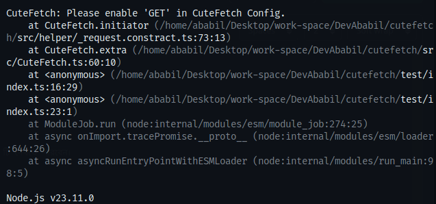
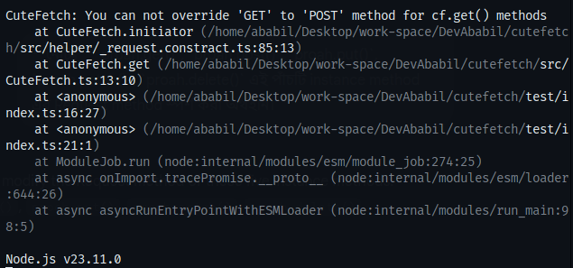
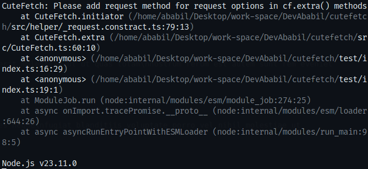
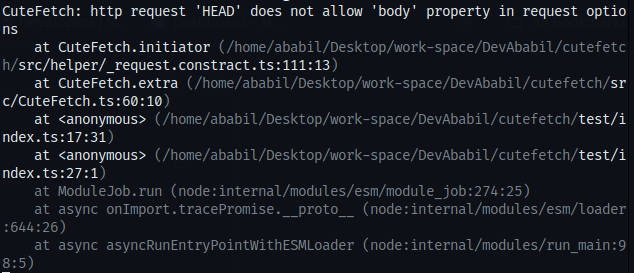
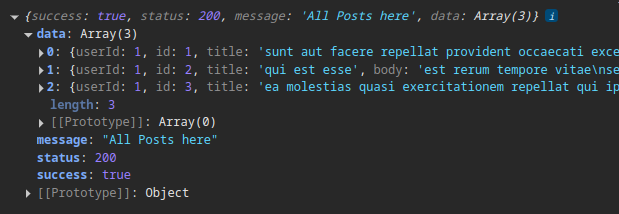

<h1 align='center'>CuteFetch</h1>

### What is CuteFetch ?

CuteFetch is a HTTP client, inspired by Axios, thats offers a sleek and minimalistic solution for modern web and Node.js applications

## 🚀 CuteFetch - Lightweight & Customizable HTTP Client

| Feature                       | Description                                                                  |
| ----------------------------- | ---------------------------------------------------------------------------- |
| 🌟 **Lightweight**            | A very lightweight library                                                   |
| ⚡ **Fast & Simple**          | Easy to use                                                                  |
| 🔄 **Auto Parsing**           | Automatically parses JSON, text, blobs                                       |
| 🎯 **Customizable**           | Can be customized and extended as desired                                    |
| 🔥 **Modern Fetch-Based**     | Built based on the modern Fetch API                                          |
| 🛠 **Supports Extra Requests** | `cf.extra()` instance method for complete control                            |
| ⏳ **Timeout Support**        | Add timeout globally or to specific instance methods                         |
| 🔄 **Transformer Properties** | Allows customization of data parsing and transformation in response handling |

# How to use?

```bash
npm install cutefetch  # Or yarn add cutefetch
```

## Includes in Project

```js
/*For ESM*/
import CuteFetch from "CuteFetch";

/*For CJS*/
const CuteFetch = require("CuteFetch");
```

## Create CuteFetch instance

```js
const cf = new CuteFetch({
  baseURL: "https://typecode-api.vercel.app",
  timeout: 12000,
  methods: ["GET", "POST", "PUT", "PATCH", "DELETE"],
  mode: "cors",
  cache: "force-cache",
  credentials: "include",
});
```

## ⚙️ CuteFetch Config Props

| Property      | Description                                                                                                               | Default                                                                                       | Optional |
| ------------- | ------------------------------------------------------------------------------------------------------------------------- | --------------------------------------------------------------------------------------------- | :------: |
| `methods`     | Array of HTTP request methods you plan to use (`GET`, `POST`, etc.). Must be explicitly defined.                          | `[]`                                                                                          |    ❌    |
| `baseURL`     | Base URL to prepend to all requests                                                                                       | `nothing`                                                                                     |    ✅    |
| `resultProps` | Key name where the final response data will be available in the result object                                             | `data`                                                                                        |    ✅    |
| `credentials` | Sets the [credentials](https://developer.mozilla.org/en-US/docs/Web/API/Request/credentials) option for all HTTP requests | `same-origin`                                                                                 |    ✅    |
| `cache`       | Sets the [cache](https://developer.mozilla.org/en-US/docs/Web/API/Request/cache) behavior for requests                    | `default`                                                                                     |    ✅    |
| `mode`        | Sets the [mode](https://developer.mozilla.org/en-US/docs/Web/API/Request/mode) for the request                            | `cors`                                                                                        |    ✅    |
| `timeout`     | Global timeout duration (in milliseconds) for all requests unless overridden per-request                                  | `5000`                                                                                        |    ✅    |
| `headers`     | Object of headers to be sent with every request (default headers can be overridden).                                      | Default browser headers are included, such as `User-Agent`, `Accept`, `Accept-Encoding`, etc. |    ✅    |

### CuteFetch instance methods (6)

1. **cf.get()**  
   **Syntax**: cf.get('/path-to-endpoint', { Request options })
2. **cf.post()**  
   **Syntax:** cf.post('/path-to-endpoint', { Request options })
3. **cf.put()**  
   **Syntax:** cf.put('/path-to-endpoint', { Request options })
4. **cf.patch()**  
   **Syntax:** cf.patch('/path-to-endpoint', { Request options })
5. **cf.delete()**  
   **Syntax:** cf.delete('/path-to-endpoint', { Request options })
6. **cf.extra()**  
   **Syntax:** cf.extra('/path-to-endpoint', { Request options })

### Request options properties:

---

### 🧰 CuteFetch - Request Properties

| Property                 | Default                                                   | Optional | Replaceable |
| ------------------------ | --------------------------------------------------------- | :------: | :---------: |
| `body`                   | `undefined`                                               |    ✅    |     ✅      |
| `query`                  | `undefined`                                               |    ✅    |     ✅      |
| `headers`                | From `CuteFetch` config or default                        |    ✅    |     ✅      |
| `timeout`                | From `CuteFetch` config or default                        |    ✅    |     ✅      |
| `baseURL`                | From `CuteFetch` config or `undefined`                    |    ✅    |     ✅      |
| `credentials`            | From `CuteFetch` config or default                        |    ✅    |     ✅      |
| `mode`                   | From `CuteFetch` config or default                        |    ✅    |     ✅      |
| `cache`                  | From `CuteFetch` config or default                        |    ✅    |     ✅      |
| `method`                 | Defined by CuteFetch method used (`GET`, `POST`, etc.)    |    ✅    |     ❌      |
| `transformResponse`      | User-defined transformer for successful responses         |    ✅    |     ❌      |
| `transformErrorResponse` | User-defined transformer for error responses              |    ✅    |     ❌      |
| `inspect`                | Custom debugger/logging function (`undefined` by default) |    ✅    |     ❌      |

## Example Request

**Create a Basic Instance**

```js
const cf = new CuteFetch({
  baseURL: "https://typecode-api.vercel.app",
  methods: ["GET", "POST", "PUT", "PATCH", "DELETE"],
  timeout: 5000,
  headers: {
    "Content-Type": "application/json",
  },
});
```

### 1. GET

**Example Success Response handling:**

```js
const { data, error } = await cf.get("/api/posts", {
  timeout: 8000,
});

if (data) {
  console.log(data);
} else {
  console.log(error);
}
```

```js
// Console Output
{
  success: true,
  status: 200,
  message: 'All Posts here',
  data: [
    {
      userId: 1,
      id: 1,
      title: 'sunt aut facere repellat provident occaecati excepturi optio reprehenderit',
      body: 'quia et suscipit\n' +
        'suscipit recusandae consequuntur expedita et cum\n' +
        'reprehenderit molestiae ut ut quas totam\n' +
        'nostrum rerum est autem sunt rem eveniet architecto'
    },
    {
      userId: 1,
      id: 2,
      title: 'qui est esse',
      body: 'est rerum tempore vitae\n' +
        'sequi sint nihil reprehenderit dolor beatae ea dolores neque\n' +
        'fugiat blanditiis voluptate porro vel nihil molestiae ut reiciendis\n' +
        'qui aperiam non debitis possimus qui neque nisi nulla'
    },
    ...more
  ]
}
```

**Example Failed Response handling:**

```js
const { data, error } = await cf.get("/api/postss"); // Invalid endpoint

if (data) {
  console.log(data);
} else {
  console.log(error); // Error output in the console
}
```

```json
// Console Output
{
  "success": false,
  "status": 404,
  "message": "Requested data will not be found"
}
```

### 2. POST

```js
const post = {
  title: "তবে গল্পটা যদি আরও কিছুটা দুরে যেতো",
  body: "মনে আছে? একদিন আমরা আঁকাশের তারা গুনছিলাম। তুমি বোকার মত বলেছিলে হ্যাঁ। আমি তোমাকে একটা খোঁচা দিলাম। অমনি তোমার হুঁশ ফিরলো আর বললে, ধুর দিনের বেলা কে তাঁরা গুনলো?",
  userId: 1,
};

const { data, error } = await cf.post("/api/posts", {
  headers: {
    "Content-Type": "application/json",
  },
  body: JSON.stringify(post),
});

if (data) {
  console.log(data);
} else {
  console.log(error); // No Error
}
```

```js
// Console Output
{
  success: true,
  status: 201,
  message: 'Post Successfully created',
  data: {
    title: 'তবে গল্পটা যদি আরও কিছুটা দুরে যেতো',
    body: 'মনে আছে? একদিন আমরা আঁকাশের তারা গুনছিলাম। তুমি বোকার মত বলেছিলে হ্যাঁ। আমি তোমাকে একটা খোঁচা দিলাম। অমনি তোমার হুঁশ ফিরলো আর বললে, ধুর দিনের বেলা কে তাঁরা গুনলো?',
    userId: 1,
    id: 101
  }
}
```

---

### 3. PUT

```js
const { data, error } = await cf.put("/api/posts/1", {
  body: JSON.stringify({
    title: "foo",
    body: "bar",
    userId: 1,
  }),
});

if (data) {
  console.log(data);
} else {
  console.log(error); // No Error
}
```

```js
// Console Output
{
  success: true,
  status: 202,
  message: 'Post updated successfully',
  data: { title: 'foo', body: 'bar', userId: 1, id: 1 }
}
```

---

### 4. PATCH

```js
const { data, error } = await cf.patch("/api/posts/1", {
  body: JSON.stringify({
    title: "তুমি আমায় ডেকেছিলে এক মেঘে ঢাকা দিনে।",
  }),
});

if (data) {
  console.log(data);
} else {
  console.log(error); // No Error
}
```

```js
// Console Output
{
  success: true,
  status: 202,
  message: 'Post partially updated!',
  data: {
    userId: 1,
    id: 1,
    title: 'তুমি আমায় ডেকেছিলে এক মেঘে ঢাকা দিনে।',
    body: 'quia et suscipit\n' +
      'suscipit recusandae consequuntur expedita et cum\n' +
      'reprehenderit molestiae ut ut quas totam\n' +
      'nostrum rerum est autem sunt rem eveniet architecto'
  }
}
```

---

### 5. DELETE

```js
const { data, error } = await cf.delete("/api/posts/5");

if (data) {
  console.log(data);
} else {
  console.log(error); // No Error
}
```

```js
// Console Output
{ success: true, status: 200, message: 'Post deleted id: 5' }
```

<h2 align='center'>EXTRA - Methods</h2>

This method can handle any HTTP Request. Additionally, it gives the Developer more control. However, the `extra` method returns a Promise Response, so if you use it, you will be responsible for handling the Promise Response yourself

It's worth noting that `HEAD` and `OPTIONS` requests can also be used via the `extra` method.

**GET** request with extra method:

```js
const response = await cf.extra("/api/posts", {
  method: "GET",
  query: {
    _limit: "1",
    _start: "2",
  },
});

const { status, statusText, ok /*... and more*/ } = response;

if (!ok) {
  // Some Error handling Logic
  console.log(await response.json());
} else {
  // manipulate respone data using response method e.g. response.text(),response.json()
  console.log(await response.json());
}
```

```js
// Console Output
{
  success: true,
  status: 200,
  message: 'All Posts here',
  data: [
    {
      userId: 1,
      id: 3,
      title: 'ea molestias quasi exercitationem repellat qui ipsa sit aut',
      body: 'et iusto sed quo iure\n' +
        'voluptatem occaecati omnis eligendi aut ad\n' +
        'voluptatem doloribus vel accusantium quis pariatur\n' +
        'molestiae porro eius odio et labore et velit aut'
    }
  ]
}
```

**Similarly, other request methods can be applied through this `extra` method.**

## 🛠️ `inspect` Property in CuteFetch Request

The `inspect` property is an optional feature that allows you to inspect and log detailed information about a request and its components before it's sent. You can use this feature to debug, log, or track specific aspects of a request's execution. The property is an object containing two parts:

1. **`name_space`**: The name for the specific inspection process, which helps in identifying logs or outputs related to this request.

2. **`rule`**: This is an object where you can specify which parts of the request to inspect. It includes options to inspect various properties of the request, such as:

   - `methods`: Whether to inspect the HTTP methods used.
   - `method`: The specific HTTP method (e.g., `GET`, `POST`).
   - `timeout`: The timeout value for the request.
   - `credentials`: The credentials used in the request.
   - `mode`: The mode for the request (`cors`, `no-cors`, etc.).
   - `cors`: Whether Cross-Origin Resource Sharing (CORS) settings are enabled.
   - `cache`: The cache settings for the request.
   - `baseURL`: The base URL used for the request.
   - `full_url`: The complete URL formed by combining `baseURL` and `query` parameters.
   - `headers`: The headers set for the request.
   - `query`: The query parameters included in the request.
   - `body`: The body content of the request.

3. **`callback`**: A function that gets called once the inspection is done. This function receives the result of the inspection, allowing you to extract and manipulate information before or after the request is made. You can use this callback to log the inspected data or perform any additional tasks.

### Example

```javascript
const { error, data, status, statusText } = await cf.put("/posts/1", {
  body: JSON.stringify({
    title: "It's Ababil Nefren",
    description: "A programmer whose brain is not static!",
  }),
  query: {
    param_a: "i am a",
    param_b: "i am b",
  },
  inspect: () => ({
    name_space: "post data fetch",
    rule: {
      // methods: true,
      // method: true,
      // timeout: true,
      // credentials: true,
      // mode: true,
      // cors: true,
      // cache: true,
      baseURL: true,
      full_url: true,
      // headers: true,
      query: true,
      body: true,
    },
    callback: (result) => {
      // Way 1: Logs the whole inspected object (the full result)
      console.log(result["post data fetch"]);

      // Way 2: Correct way to extract data using the extract method
      const { body, query } = result.extract();

      if (body) {
        console.log("Body content: ", JSON.parse(body)); // Log the body content (if available)
      }

      console.log("Query parameters: ", query); // Log query parameters
    },
  }),
});
```

### How it works:

- **`name_space`**: This helps you identify logs specific to this request.
- **`rule`**: By setting this to `true`, you specify which request parts you want to inspect. In the example above, we're inspecting the `baseURL`, `full_url`, `query`, and `body` properties.
- **`callback`**: The `callback` function is executed with the result of the inspection. You can then extract specific properties (e.g., `body` and `query`) and perform actions like logging them or manipulating the data.

### Notes:

- Use the `inspect` feature to keep track of request parameters and details for debugging or logging purposes.
- The callback function gives you flexibility to log, process, or store any information you need from the request.

This feature is powerful for debugging or understanding how requests are made under the hood.

Here is the updated documentation with the addition of a **"Transformer"** title for `transformResponse` and `transformErrorResponse`:

## 🚀 Transformer: `transformResponse` and `transformErrorResponse`

### Overview

- **`transformResponse`**: This is a function that allows you to modify or transform the response data before it's made available to your code. It's called only when the request succeeds.
- **`transformErrorResponse`**: This is a function that lets you modify or transform the error response before it's made available to your code. It is called only in the case of an error (i.e., when the request fails).

### Properties

#### `transformResponse`

- **Purpose**: Allows you to transform the response data after the request has succeeded.
- **Arguments**: The function receives the `data` (the successful response) as its argument.
- **Return Value**: You should return the modified data from this function. The returned data will be passed to the `data` property in the response object.

#### Example:

```javascript
const { data, error } = await cf.get("/some-endpoint", {
  transformResponse: (data) => {
    // Example: Convert response data to uppercase before returning
    return data.toUpperCase();
  },
});
```

In this example, any data returned from `/some-endpoint` will be transformed to uppercase before it's made available to your code.

#### `transformErrorResponse`

- **Purpose**: Allows you to transform the error response in case of a failed request.
- **Arguments**: The function receives the `error` (the failed response) as its argument.
- **Return Value**: You should return the modified error from this function. The returned error will be passed to the `error` property in the response object.

#### Example:

```javascript
const { data, error } = await cf.get("/some-endpoint", {
  transformErrorResponse: (error) => {
    // Example: Add custom message to error
    return {
      ...error,
      message: "Something went wrong while fetching data",
    };
  },
});
```

In this example, if the request fails, the error will be transformed by adding a custom message to it before it's made available in the `error` property.

---

### Full Example with Both `transformResponse` and `transformErrorResponse`:

```javascript
const { error, data, status, statusText } = await cf.put("/posts/1", {
  body: JSON.stringify({
    title: "It's Ababil Nefren",
    description: "A programmer whose brain is not static!",
  }),
  query: {
    param_a: "i am a",
    param_b: "i am b",
  },
  transformResponse: (data) => {
    // Modify the response data here, e.g., logging it or altering it
    console.log("Original Data:", data);
    return {
      ...data,
      transformed: true, // Add a custom property to the response
    };
  },
  transformErrorResponse: (error) => {
    // Modify the error response here, e.g., adding custom properties
    console.log("Error Data:", error);
    return {
      ...error,
      customError: "There was an issue with your request.",
    };
  },
});

if (data) {
  log.info("Transformed Data:", data);
} else {
  log.info("Transformed Error:", error);
}
```

### Explanation:

1. **`transformResponse`** is used to modify the successful response data. In the example above, the original data is logged, and a new property `transformed: true` is added to the response.
2. **`transformErrorResponse`** is used to modify the error response. Here, the original error is logged, and a new custom error message is added.

### When to Use:

- Use **`transformResponse`** if you need to format or modify the data before your application uses it.
- Use **`transformErrorResponse`** to adjust error handling or add custom messages, logging, or other properties to errors.

Here's a more attractive and engaging version for the heading and documentation:

## ✨ **Create Your Own Global Transformer**

_Customize your response and error handling for ultimate flexibility!_

To provide maximum flexibility, CuteFetch doesn't enforce global response or error transformers. Instead, i leave it up to you to create **global transformers** that suit your app's needs. Whether you need to transform your data for every request or handle errors in a custom way, the choice is in your hands. 🌟

### 🔨 **How to Create Your Own Global Transformers**

You can create **global response and error transformers** by defining higher-order functions that will transform the data from all requests in your application. Whether you need to log, format, or handle errors in a special way, this approach lets you craft a solution that's perfect for your project.

#### 🔄 **Custom Response Transformer**

If you want to modify the response data across multiple requests, create a **global response transformer**.

```javascript
function createResponseTransformer(transformer) {
  return function (data) {
    // Apply custom logic to modify the data
    console.log("Modified Response:", data);
    return transformer(data);
  };
}
```

Use the transformer across your app like so:

```javascript
const customResponseTransformer = createResponseTransformer((data) => {
  return { ...data, transformed: true }; // Add custom fields
});

// Applying the transformer globally in requests
const { data } = await cf.get("/some-endpoint", {
  transformResponse: customResponseTransformer,
});
```

#### ⚠️ **Custom Error Transformer**

Handle errors across your app with a **global error transformer**. Customize the way you process errors, add logs, or modify error messages for better clarity.

```javascript
function createErrorTransformer(errorTransformer) {
  return function (error) {
    console.error("Transformed Error:", error);
    return errorTransformer(error);
  };
}
```

Here’s how to use it:

```javascript
const customErrorTransformer = createErrorTransformer((error) => {
  return { ...error, customMessage: "Oops, something went wrong!" };
});

// Applying the transformer globally in requests
const { data, error } = await cf.get("/some-endpoint", {
  transformErrorResponse: customErrorTransformer,
});
```

---

### 🌍 **Why Create Your Own Transformers?**

- **Ultimate Control**: Tailor the transformation logic exactly to your app's needs.
- **Reusability**: Once created, you can reuse your custom transformers in multiple places throughout your app.
- **Cleaner Code**: Keep your codebase clean by separating the transformation logic into reusable functions.

---

### 📚 **Learn More**

To dive deeper, check out our detailed guide on [creating custom transformers](./partial_doc/custom_transformer.md) and start customizing your requests for more powerful, dynamic behavior.

<h2 align='center'> Error and Exceptions</h2>

You need to add the corresponding HTTP method in the `CuteFetch` Configuration for each `CuteFetch` instance method you intend to use.

For example: If you want to use the `cf.get()` method, you need to add it to the `CuteFetch` Configuration.

```js
const cf = new CuteFetch({
  methods: ["GET"],
  ...others,
});
```

If you call the `cf.get()` method without adding "GET" to the methods array in the `CuteFetch` configuration, you will see the following error:

<div align="center">
  
</div>

Similarly, you need to add all the HTTP Request methods you intend to use to the methods Array in the `CuteFetch` Configuration.

---

If you mistakenly change the HTTP Request method, you will see the following error.

For example:

```js
const result = await cf.get("/posts", {
  method: "POST",
});
```

<div align="center">
  
</div>

Note: It is pointless to try to modify the Request method of these five instance methods: `cf.get()`, `cf.post()`, `cf.put()`, `cf.patch()`, `cf.delete()`.

---

If you use the `cf.extra()` method, you must include the Request Method within the options.

For example:

```js
const response = await cf.extra("/posts", {
  method: "GET",
});

const { status, statusText, ok /*... and more*/ } = response;

if (!ok) {
  // Some Error handling Logic
} else {
  // manipulate respone data using response method e.g. response.text(),response.json()
}
```

If you don't do this, you will see the following error:

For example:

```js
const response = await cf.extra("/posts", {});
```

<div align="center">
  
</div>

---

### Bodyless HTTP request for CuteFetch:

```
 GET HEAD OPTIONS DELETE
```

If you include a body property in the options for the mentioned Bodyless HTTP requests, you will observe the following error.

For example:

```js
(async () => {
  try {
    const response = await cf.extra("/posts/1", {
      method: "HEAD",
      body: JSON.stringify({ name: "Ababil", age: undefined }),
    });
    if (response.ok) {
      console.log(await response.headers);
    }
  } catch (error) {
    console.log(error);
  }
})();
```

<div align="center">
  
</div>

## How to use it in plain HTML

**app.js**

```js
// Import CuteFetch from unpkg (ESM)
import CuteFetch from "https://www.unpkg.com/cutefetch@<version>/dist/index.mjs";

// Replace <version> with the latest version from https://www.npmjs.com/package/cutefetch?activeTab=versions
// For example: cutefetch@1.2.3

// create CuteFetch instance
const cf = new CuteFetch({
  baseURL: "https://typecode-api.vercel.app",
  methods: ["GET", "POST", "PUT", "PATCH", "DELETE"],
  timeout: 12000,
  headers: {
    "Content-Type": "application/json",
  },
});

// use intance method
cf.get("/api/posts", {
  query: {
    _page: "1",
    _limit: "3",
  },
})
  .then(console.log)
  .catch(console.log);
```

**index.html**

```html
<!DOCTYPE html>
<html lang="en">
  <head>
    <meta charset="UTF-8" />
    <meta name="viewport" content="width=device-width, initial-scale=1.0" />
    <title>Document</title>
  </head>
  <body>
    <!-- linkup app.js in html -->
    <script type="module" src="./app.js"></script>
  </body>
</html>
```

**Inside browser console**

<div align="center">
  
</div>

### Supported HTTP Methods for CuteFetch

```
GET, POST, PUT, DELETE, PATCH, HEAD, OPTIONS ✔️
```

---

---

<h3 align='center'>Thanks to you, and take care of your eyes.</h3>

<p align='center'>❤️😊</p>
